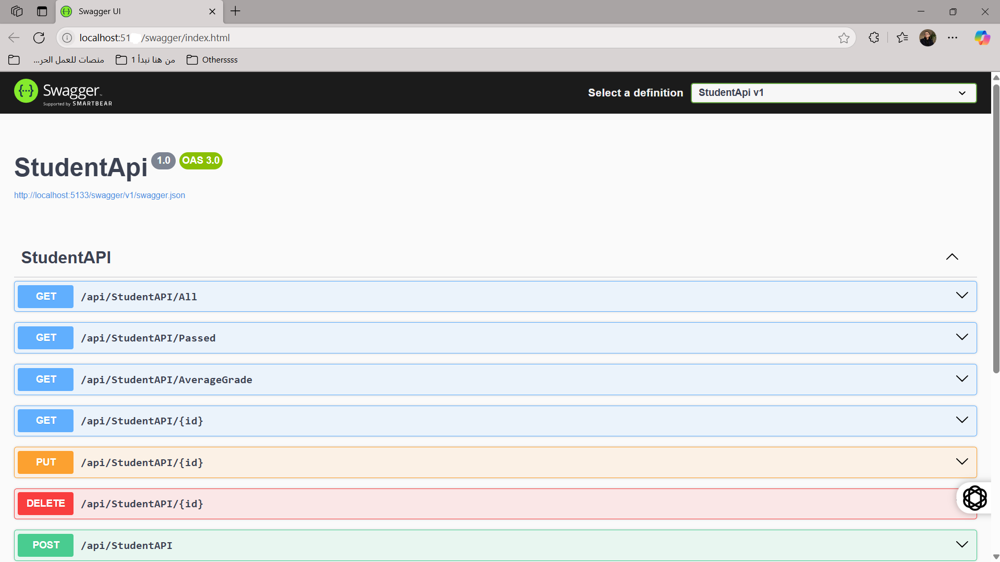

# Student Management API

📅 **Project Date:** July 2025  
🛠️ **Technology Stack:** C#, ADO.NET, SQL Server, 3-Tier Architecture

---

## 📚 Description
A RESTful API project built using C# and .NET to manage student data.  
Implements CRUD operations with a structured multi-layered approach (UI, BLL, DAL).

---

## ✨ Features
- Add / Edit / Delete / View students
- Connected to SQL Server database
- Uses Data Transfer Objects (DTO)
- Structured using OOP and separation of concerns

---

## 🚀 Getting Started
1. Clone the repository
2. Open the solution in Visual Studio
3. Configure your SQL Server connection string
4. Run the application and test the endpoints via Postman or Swagger

---

## 👨‍💻 Author
**Abdallah Badawi**  
- Email: eng.abdallah.k.badawi@gmail.com  
- [LinkedIn](https://www.linkedin.com/in/abdullah-badawi/)
