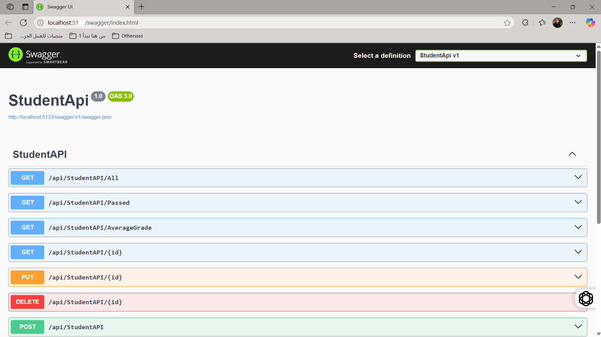

# Student Management API

📅 **Project Date:** July 2025  
🛠️ **Technology Stack:** C#, ADO.NET, SQL Server, 3-Tier Architecture

---

## 📚 Description
A RESTful API project built using C# and .NET to manage student data.  
Implements CRUD operations with a structured multi-layered approach (UI, BLL, DAL).

---

## ✨ Features
- Add / Edit / Delete / View students
- Connected to SQL Server database
- Uses Data Transfer Objects (DTO)
- Structured using OOP and separation of concerns



---

## 📥 Download and Install Project
### 1. Clone the repository
### 2. Restore the Database
1. Open SQL Server Management Studio
2. Write this command:
```bash
RESTORE DATABASE StudentsDB
FROM DISK = 'C:\Student-Management-API-July2025-main\StudentsDB.bak'
--OR: Write where the backup copy is located in your computer
```
### 3. Open the solution in Visual Studio
### 4. Configure the SQL Server connection string
### 5. Build and run the application

---

## 👨‍💻 Developer
**Abdallah Badawi**  
- Email: eng.abdallah.k.badawi@gmail.com  
- [LinkedIn](https://www.linkedin.com/in/abdullah-badawi/)
---
⭐ If you like this project, don't hesitate to give it a star!
